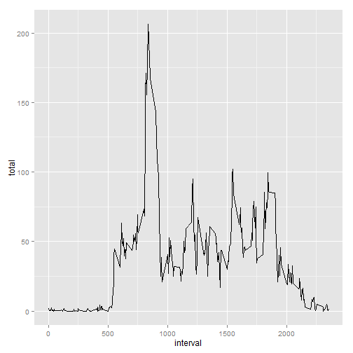
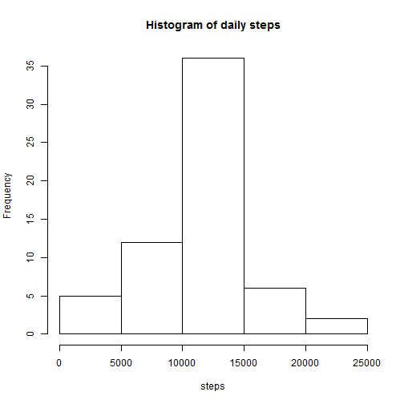
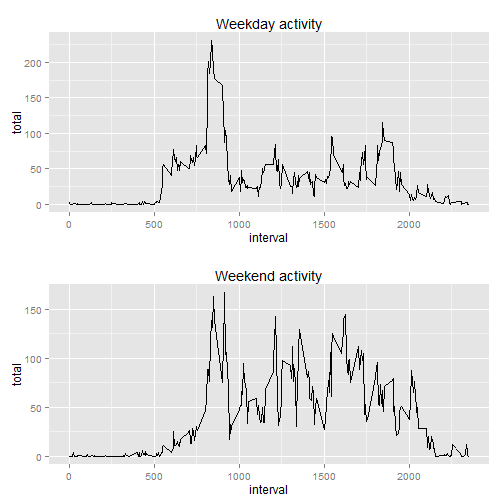

## Loading and preprocessing the data
1. Take out the NA values
2. Group by date
3. Sum the steps by date

```r
library(dplyr);
```

```
## 
## Attaching package: 'dplyr'
## 
## The following object is masked from 'package:stats':
## 
##     filter
## 
## The following objects are masked from 'package:base':
## 
##     intersect, setdiff, setequal, union
```

```r
library(ggplot2);
activity <- read.table("activity.csv",sep=",", header=TRUE);
dayact<-activity[!is.na(activity$steps),]%>% group_by(date) %>% summarise(total = sum(steps));
intact<-activity[!is.na(activity$steps),]%>% group_by(interval) %>% summarise(total = mean(steps));
```


## What is mean total number of steps taken per day?
4. Generate the histogram

```r
hist <- ggplot(dayact, aes(x = date));
hist + geom_histogram(binwidth=.5, aes(y = total), stat="identity");
```

 


5. Calculate the mean

```r
mean(dayact$total);
```

```
## [1] 10766.19
```


6. calculate the median


```r
median(dayact$total);
```

```
## [1] 10765
```


## What is the average daily activity pattern?


7. Create the line plot for the daily pattern

```r
gp <- ggplot(data=intact, aes(x=interval, y=total));
gp + geom_line();
```

 


8. Obtain the maximum step interval


```r
subset(intact, total==max(intact$total))
```

```
## Source: local data frame [1 x 2]
## 
##   interval    total
## 1      835 206.1698
```


## Imputing missing values


9. Calculate the number of missing step values.

```r
sum(!is.na(activity$steps))
```

```
## [1] 15264
```


10. NAs will be substituted by the interval mean. It is already calculated.
11. Go through all the data identifying the NAs and substituting them.


```r
clactivity<-activity;
for(i in 1:nrow(clactivity)) {
if(is.na(clactivity[i,]$steps)) {
clactivity[i,is.na(clactivity[i,])] <- intact[intact[,1]==clactivity[i,]$interval,2];
}
}
```

12. Recalculate the total number of steps taken each day with the new values

```r
dayactcl<-clactivity[!is.na(clactivity$steps),]%>% group_by(date) %>% summarise(total = sum(steps));
hist <- ggplot(dayactcl, aes(x = date));
hist + geom_histogram(binwidth=.5, aes(y = total), stat="identity");
```

 
13. Calculate the new mean

```r
mean(dayactcl$total);
```

```
## [1] 10766.19
```

14. Calculate the new median

```r
median(dayactcl$total);
```

```
## [1] 10766.19
```

15. Compare to the initially obtained values
- Original mean

```
## [1] 10766.19
```
- New mean

```
## [1] 10766.19
```
- Original median

```
## [1] 10765
```
- New median

```
## [1] 10766.19
```

## Are there differences in activity patterns between weekdays and weekends?

16. Calculate the day of the week and see if it is weekend
17. Merge the week day to the frame
18. Sumarize the new data
19. Draw the plot.


```r
day<-c()
for(i in 1:nrow(clactivity)) {
if(grepl(weekdays(as.Date(clactivity[i,]$date, "%Y-%m-%d")), "sábado") || grepl( weekdays(as.Date(clactivity[i,]$date, "%Y-%m-%d")), "domingo")) {
day[i]<-"weekend"
} else {
day[i]<-"weekday"
}
}
clactivity$day<-day

weekdayact<-clactivity[!is.na(clactivity$steps),] %>% filter(day=="weekday")%>% group_by(interval) %>% summarise(total = mean(steps));
weekendact<-clactivity[!is.na(clactivity$steps),] %>% filter(day=="weekend")%>% group_by(interval) %>% summarise(total = mean(steps));


require(grid)
```

```
## Loading required package: grid
```

```r
vp.layout <- function(x, y) viewport(layout.pos.row=x, layout.pos.col=y)
arrange_ggplot2 <- function(..., nrow=NULL, ncol=NULL, as.table=FALSE) {
  dots <- list(...)
  n <- length(dots)
  if(is.null(nrow) & is.null(ncol)) { nrow = floor(n/2) ; ncol = ceiling(n/nrow)}
	if(is.null(nrow)) { nrow = ceiling(n/ncol)}
	if(is.null(ncol)) { ncol = ceiling(n/nrow)}
        ## NOTE see n2mfrow in grDevices for possible alternative
grid.newpage()
pushViewport(viewport(layout=grid.layout(nrow,ncol) ) )
	ii.p <- 1
	for(ii.row in seq(1, nrow)){
	ii.table.row <- ii.row	
	if(as.table) {ii.table.row <- nrow - ii.table.row + 1}
		for(ii.col in seq(1, ncol)){
			ii.table <- ii.p
			if(ii.p > n) break
			print(dots[[ii.table]], vp=vp.layout(ii.table.row, ii.col))
			ii.p <- ii.p + 1
		}
	}
}

gp1 <- ggplot(data=weekdayact, aes(x=interval, y=total));
gp1 <- gp1 + geom_line();
gp1 <- gp1 + ggtitle("Weekday activity");
gp2 <- ggplot(data=weekendact, aes(x=interval, y=total));
gp2 <- gp2 + geom_line();
gp2 <- gp2 + ggtitle("Weekend activity");
arrange_ggplot2(gp1,gp2,ncol=1);
```

 


